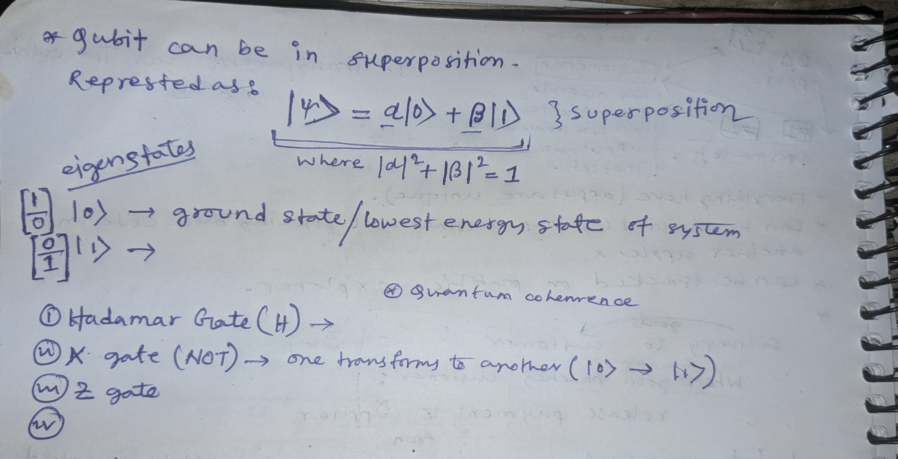

# Quantum Coin Flip

This is a simple application that demonstrates the concept of quantum computing through a quantum coin flip. In classical computing, a coin flip would use Math.random() - basically picking either 0 or 1. The coin is always in one definite state. But in quantum computing, we start with a quantum bit (qubit) in state |0⟩. Using a Hadamard gate (H), we create a superposition where the coin exists in multiple realities simultaneously! In one "universe" it's heads, in another it's tails - and these universes coexist until we measure. When we measure it, these parallel realities "collapse" into our single reality.

## How is this different from regular computing?

In classical computing (like your phone or laptop), a coin flip would use Math.random() - basically picking either 0 or 1. The coin is always in one definite state. But in quantum computing:
- We start with a quantum bit (qubit) in state |0⟩
- Using a Hadamard gate (H), we create a superposition where the coin exists in multiple realities simultaneously!
- In one "universe" it's heads, in another it's tails - and these universes coexist until we measure
- When we measure it, these parallel realities "collapse" into our single reality

## What are Quantum Gates?

Quantum gates are like the basic building blocks of quantum circuits - similar to how classical computers use AND, OR, and NOT gates. They manipulate qubits to perform quantum operations.

Common quantum gates and their future applications:
- Hadamard (H) Gate: Creates superposition by putting a qubit in an equal mixture of 0 and 1 states.
- X Gate (NOT): Flips a qubit from |0⟩ to |1⟩ or vice versa
- Z Gate: Adds a phase difference between states
- CNOT Gate: A two-qubit gate for controlled operations
- Toffoli Gate: A three-qubit gate that enables reversible computing

## Why aren't we using these now?

Current quantum computers are still in their infancy. They suffer from "decoherence" (quantum states breaking down) and require extreme conditions (near absolute zero temperatures). Scientists are working to overcome these challenges, but it might take 5-10 years before we see practical applications.

## Cool fact:

The Hadamard gate we use puts our qubit in a perfect 50-50 superposition, making our quantum coin flip truly random, unlike classical random number generators!

